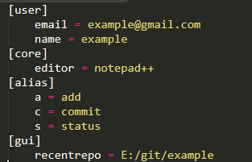
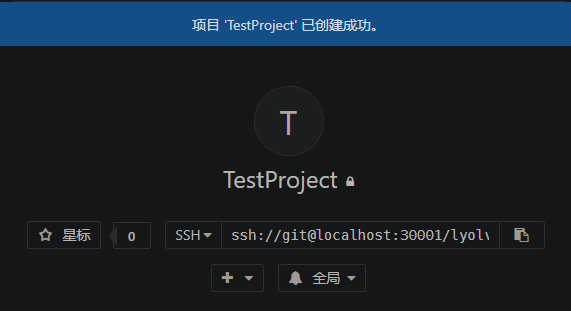
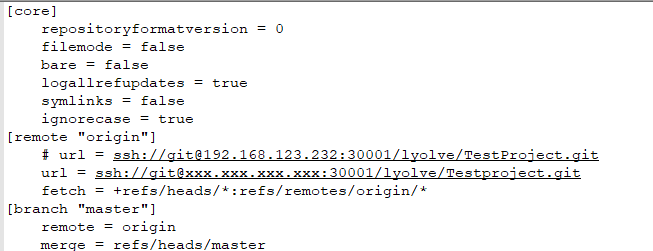
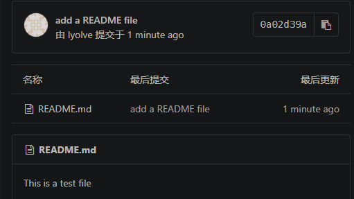

# Git 个人手册

[TOC]

Author：Jiang Anyao（蒋安尧）
Email：756618992@qq.com

写在前面的话：

- 本文所用在线平台为自己架设的NAS服务器的gitlab私有仓库，没有的用github代替即可
- 最佳阅读软件为Typora
- 本文 献给 差点因为我的无知而被错过的Git，并对程序员之神Linus Torvalds表示衷心感谢


## 0. Git意义

- 网络出问题，集中式版本库无法正常操作
- 分布式更加安全，在本地留有完整备份与版本记录，支持离线
- Git 为分布式版本库


## 1. 环境配置

- windows：[https://gitforwindows.org](https://gitforwindows.org)

	- 再安装下tortoiseGit [https://tortoisegit.org](https://tortoisegit.org/)

- Linux： [http://git-scm.com/downloads/guis](http://git-scm.com/downloads/guis)

  - 或者用 sudo apt-get install git

  

## 2. 初始化

### 1. 初始化本地git

先新建一个空文件夹作为磁盘内的git仓库，之后的项目都可以放在这个文件夹里面

```
git config --global user.name '用户名'
git config --gloabl user.email '邮箱'
```

以上指令会在根目录(`/home`或者`c:/user/用户名/`)里面创建`.gitconfig`文件，内容类似下图



简介：

> user
>
> > email：登陆git的邮箱
> > name：登陆git的密码
>
> core
>
> > editor：设置git默认编辑器(subl, vim, notepad++, vscode)
>
> alias：设置短指令
>
> > a = add：指令打`git a .`即可替代`git add .`

----

创建一个文件夹，并进入

```python
# 创建文件夹
mkdir 文件夹名
cd 文件夹名

git init
```

### 2. 初始化SSH

```
ls -al ~/.ssh
ssh-keygen -t rsa -C 'GITLAB用户名'
cat ~/.ssh/id_rsa.pub
```

将生成的id_rsa.pub文件下的内容复制到gitlab的 ssh设置中

### 3. 从已有项目clone

**(如果是上传历史遗留代码，建议先在gitlab创建空项目，然后克隆至本地，然后再将要上传的复制进去并上传)**

```python
git clone gitlab项目地址
cd 项目名称
touch REAMDE.md		# 生成一个README文件
git add .
git commit -m 'add README file'		# 本地提交并附上信息
git push -u origin master(http传输方式下push需要输入gitlab登陆账户和密码)
```

### 4. 从已有文件夹创建git新项目

```
cd 文件夹
git init
git remote add origin http://gitlab项目地址.git
```

### 5. 用已有文件夹取代非空git项目

```
cd 文件夹
git remote rename origin old-origin
git remote add origin http://gitlab项目地址.git
```

### 6. 从gitlab更新本地git代码

```
git pull
```


## 3. git使用简短教学(跟着来一遍就能学会)

先进入gitlab创建一个空的项目，本例中SSH为`ssh://git@localhost:30001/lyolve/TestProject.git`



### 1. 克隆并配置

`git clone ssh://git@192.168.1.1:30001/lyolve/TestProject.git`，注意修改localhost为自己的ip(内网ip/公网ip，如果没有静态公网ip，先填自己的内网ip

```
cd TestProject
ll -a
cd .git
ls
cat config
```

- 这时能看到自己的项目配置文件信息，其中url对应项为ssh地址，此时应该是内网ip
- 想任何时候都能访问本地服务器，需要改成公网ip，将原来的url注释，在下边一行复制一遍并更改
- 如果公网ip会变(通常是重启路由器时)，在公网ip改变时重修修改此项即可
- 强烈不建议私有仓库用http方式传输，请用ssh，否则会直接暴露信息

```python
# 修改方式
subl config		# 用sublime修改(需安装sublime环境)
vi config	# 前提是熟悉vim指令
notepad config	#用windows默认文本编辑器
notepad++ config	# 用notepad++编辑
```

改完之后是这样的画风



### 2. 创建README文件本地提交并上传至gitlab

```python
# 创建并编辑一个README文件
cd .. # 退回到.git上级目录
touch README.md
vi README.md
# 按i
This is a test file
# 按Esc
:wq
cat README.md
```

```python
# 本地提交
git status	# 查看当前仓库状态
git add README.md
# 如果文件数量多，用git add .
git status
git commit -m 'add a README file'
# git 提交强制要求输入一个提示信息
```

```python
# 推到gitlab仓库
git push -u origin master
```

前往gitlab查看



### 3. 查看操作日志

```python
git log	# 查看刚才提交生成的哈希值
```

#### **日志可选参数**

==可组合，有些互斥==，这里含义指仅带这一参数有什么效果
完整可选参数用`git log --help`查看

| 序号 | 参数          | 含义                                        |
| ---- | ------------- | ------------------------------------------- |
| 1    | -p            | 最详细信息,按补丁格式显示每个更新之间的差异 |
| 2    | -1            | 最近一次提交,要看几次填几                   |
| 3    | --name-only   | 显示改动文件清单                            |
| 4    | --oneline     | 一行显示，只显示哈希值和提交说明            |
| 5    | --name-status | 显示改动文件名称与改变操作类型              |
| 6    | --graph       | 显示 ASCII 图形表示的分支合并历史           |
| 7    | --stat        | 显示每次更新的文件修改统计信息              |
| 8    | --format=" "  | 控制显示记录格式                            |

```python
# 格式
%H	# 提交对象（commit）的完整哈希字串
%h	# 提交对象的简短哈希字串
%T	# 树对象（tree）的完整哈希字串
%t	# 树对象的简短哈希字串
%P	# 父对象（parent）的完整哈希字串
%p	# 父对象的简短哈希字串
%an	# 作者（author）的名字
%ae	# 作者的电子邮件地址
%ad	# 作者修订日期（可以用 -date= 选项定制格式）
%ar	# 作者修订日期，按多久以前的方式显示
%cn	# 提交者(committer)的名字
%ce	# 提交者的电子邮件地址
%cd	# 提交日期
%cr	# 提交日期，按多久以前的方式显示
%s	# 提交说明
```

### 4. 精简指令

#### 1. git 层面

```python
cat ~/.gitconfig
subl ~/.gitconfig	# 没有sublime用其他几个即可
```

> alisa
>
> > a = add
> > c = commit
> > s = status
> > p = push
> > puom = push -u origin master
> > l = log
> > no = --name-only
> > ol = --oneline
> > ns = --name-status
> > g = --graph
> > logs = log --format='%h -%an, %ar : %s'  --name-status --graph

保存后关闭sublime

```python
git logs
git s
```

生效即可


#### 2. 系统层面

```
cat ~/.bash_profile
subl ~/.bash_profile
```

>alias gs="git status"
>alias gc="git commit -m"
>alias gls="git log --format='%h -%an, %ar : %s'  --name-status --graph"
>alias gb="git branch"
>alias ga="git add"
>alias go="git checkout"

保存后关闭sublime，重新打开终端

```python
gls
gs
```

生效即可


### 5. **分支操作**

1. 查看存在所有分支

	```
	git branch
	```

2. 创建并进入新分支

  ```
  git checkout -b newbranch
  git push origin newbranch
  gb -a		# 查看远程分支
  git remote -v		# 查看远程仓库
  ```

3. 修改新分支的文件

	```python
	cat README.md
	vi README.md
	# 按i，并修改文件
	# Esc
	:wq
	cat README.md
	
	# 我做的修改
	>> This is a test file
	>> modify in branch 'newbranch'
	```

	```python
	gs	# 使用短指令的前提是按第四步修改设置
	ga README.md
	git s
	gc 'change file in newbranch'
	gs
	```

4. 查看分支与主分支在本地的情况

	```python
	cat README.md
	>> This is a test file
	>> modify in branch 'newbranch'
	touch newfile.txt
	gs
	ga .
	gc 'create a new file'
	gls
	# 此时去看本地文件夹，应当是包含README.md,newfile.txt两个文件
	gb
	go master
	gb
	cat README.md
	>>This is a test file
	# 此时去查看本地文件，发现只有一个README.md，而且内容未修改
	go newbranch	# 切换回更改后的分支
	# 再查看本地文件，发现改动回来了，不是很清楚原理，只觉得很神奇很炫酷，猜想是根据commit操作生成的哈希数值还原文件
	# 此时关闭终端，两个文件都还在，再打开终端
	go master
	# 关闭终端，只剩一个文件
	# 最神奇的是查看切换前后，TestProject文件夹大小居然更改了，正是因为此特性，我成为git脑残粉
	# 本来觉得自己开发用分支没啥意义，自己的程序还搞什么分支，又担心操作失误覆盖掉主分支，又觉得浪费空间，真有需求复制一份出来不就行了，简直多此一举，发现这个特性后，才明白还是自己年轻了
	```

	

#### 合并分支正确打开方式

##### 1. 从主分支更新

直接上最复杂的情况

1. 首先进入主分支修改文件，模拟主分支与次分支同时开发的情况

	```python
	go master
	vi README.md
	# 按i，并修改文件
	# Esc
	:wq
	cat README.md
	
	# 我做的修改
	>> This is a test file
	>> write new code
	
	gs
	ga .
	gc 'modify readme file in master'
	gls
	git push -u origin master
	```

2. 切换到分支

	随着开发的迭代，应当经常去跟进主分支的开发情况

	```python
	go newbranch
	```

3. ==从主分支更新==

	**注意**：介绍两种方法，官方应该是建议第二种，这块也有争议

	---

	- ==rebase法==：日志会比较清晰，不会出现非常复杂的合并记录

	```python
	# 此处需要测试两种方案，提前复制好副本
	git pull origin master:newbranch --rebase		# 从主分支的git仓库拉最新代码
	 git am --show-current-patch	# 查看冲突
	```
	
	由于README.md两个分支都做了修改，会出现冲突，需要手动处理
	
	```python
	cat README.md
		
		
		This is a test file
		<<<<<<< HEAD
		write new code
		=======
		modify in branch 'newbranch'
		>>>>>>> 7a386d1ee64c1c98a36ab54c89c6b7f8227e9107
	```
	
	<<<<<<< HEAD为冲突头部标识，上方为不冲突内容，下方为冲突内容，等号隔离冲突内容，需要手动修复冲突，末尾的>>>>>>>为末尾标志+哈希值
	
	```python
	# 假设这是需要的效果，自己修改后保存
	
	This is a test file
	write new code
	modify in branch 'newbranch'
	```
	
	```python
	git add .
	git rebase --continue
	gls
	```
---

- ==merge法==：追根溯源会比较完整，但是log会比较乱

```python
git pull origin master:newbranch --no-ff -m 'pull from master'
# 用同样的方式处理
git add .
gc 'update from master'
gls
```
​	如果两种方法都尝试了，能够再`gls`时看到区别，个人建议用merge法比较稳妥

##### 2. 分支开发完成合并到主分支

在合并前首先需要从主分支更新

1. 更新分支

	```python
	cat README.md
	
	>> This is a test file
	>> modify in branch 'newbranch'
	>> write new code
	# 在文件最下面一行写入
	>> newbranch finished
	```

2. 合并到主分支

	```
	gs
	ga .
	gc 'finished newbranch'
	go master
	gb --no-merged	# 查看未合并分支
	git merge newbranch --no-ff -m 'merge newbranch'
	gls
	cat README.md
	
	>> This is a test file
	>> modify in branch 'newbranch'
	>> write new code
	>> newbranch finished
	```

3. 删除无用的分支

	```
	gb
	gb --merged		# 查看已合并分支
	gb -D newbranch		# 删除分支newbranch
	gb
	```


### 6. gitignore

屏蔽某些格式的文件，实质不上传到gitlab

```
touch .gitignore
```

```python
# 规则
# 1.不提交txt文件：	*.txt
# 2.除了a.txt，其他不提交：	！a.txt
# 3.不提交文件夹：		/file
```


### 7. 标签

1. `git tag`：查看当前标签
2. `git tag -a v1.0 -m 'release 1.0' `：打标签
3. `git push origin v1.0`：上传远程标签
4. `git tag -d v1.0`：删除标签
5. `git push origin :v1.0`：删除远程标签
6. ` git archive -v --format=zip  v1.0 > test.zip`：提取带标签的版本并打包


### 8. 修改提示信息，回退版本

```python
ls
rm -rf newfile.txt	# 删除文件
ls
ga
gc 'delete newfile.txt'
gs
```

```python
git commit --amend -m 'change log'
gs
gls
git push -u origin master
```

版本回退

- ==reset法==

```python
gls
# 如果需要回退到7a386d1这一版本是分支合并过来前的版本
# 我的这一版本是
git reset --hard 7a386d1 
cat README.md
>> This is a test file
>> write new code

gls
# 发现所有后面的日志全没了，事实上reset是一些公司禁止的操作
# 此处的操作实际上是将版本指针直接往回移动，会失去之后的提交信息
# 此时push会报错，需要用 git push -f 强制提交更改
git reflog	# 查看操作日志，找回回退前的版本
git reset --hard f74e8bf	# 返回回退前的版本
```

- ==revert法==

```python
# 原理是撤销当前commit，并新建一个commit，逆向操作一遍，可能会出现冲突
git revert -n 7a386d1
gls
# 记录还在
gs
# 解决冲突
git revert --continue
ga .
gc 'revert to 7a386d1'
gls
# 可以看到生成了一个新的版本哈希值，同时以前的日志还在
```


初学者掌握到这边差不多了，需要掌握更多的话自己探索吧:laughing:

